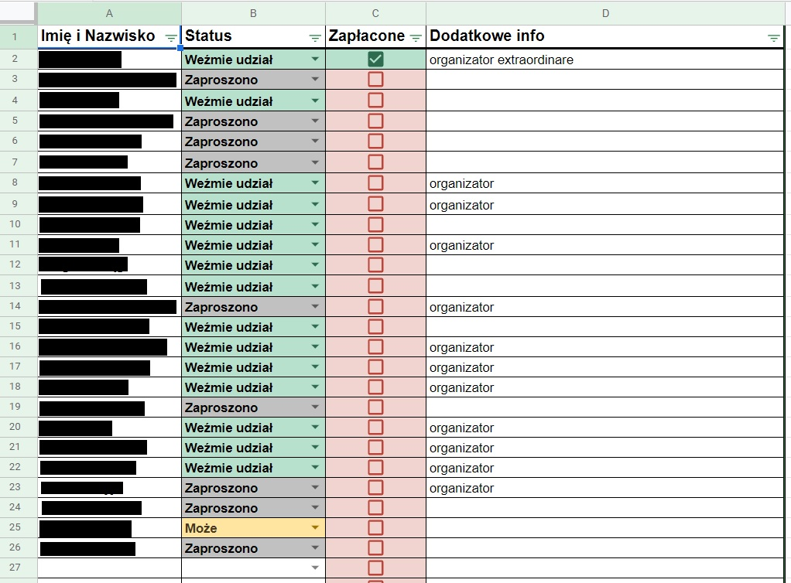
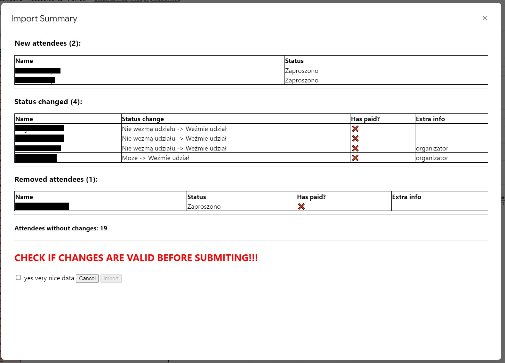

# gsheet-fb-contribution-tracking-script

A Google Apps Script for tracking contribution and attendance of facebook event in google sheet.  
Allows importing facebook event attendance info from csv file.  
Paid status and additional info is persisted across imports.

⚠️ Status column is not internationalized because I don't care.  
If you use csv with statuses in different language every record will be treated as status change

## Installation

1. Copy all files into your Google Apps Script
2. Assign function `startCSVUpload` to a button (a drawing) in the spreadsheet
3. Fill in the legend cells:  
   A1: Name  
   A2: Attendance Status (Recommened: Coditional formatting based on status)  
   A3: Sync (checkbox) (Recommended: Conditional formatting based on if cell is true/false)  
   A3: Paid? (checkbox) (Recommended: Conditional formatting based on if cell is true/false)  
   A4: Additional info
4. (Optional) Make Sync column checkboxes

